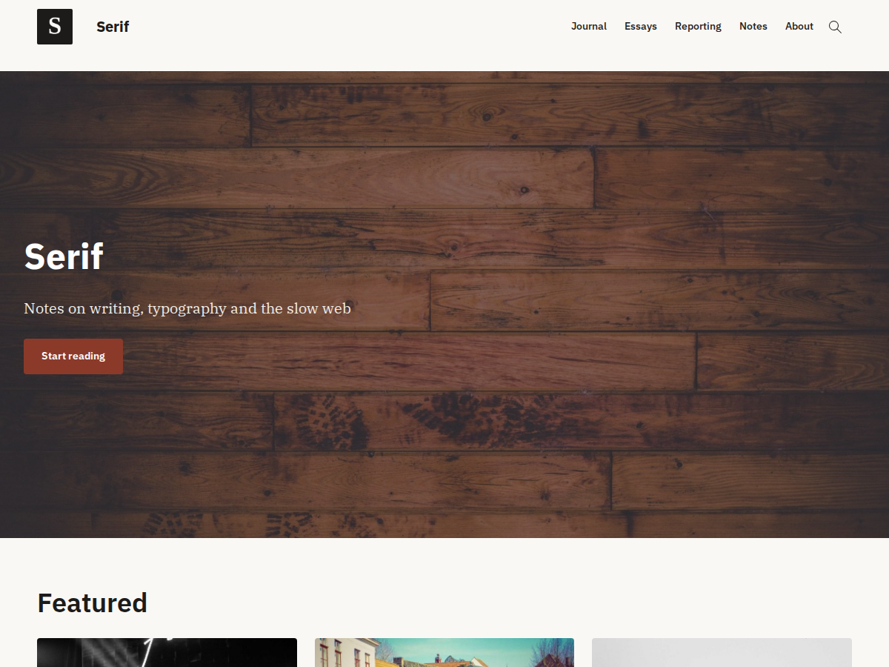

# Serif

A minimalist, typography-first WordPress block theme for writers, journalists and designers. Warm paper, IBM Plex, a 720px measure, WCAG 2.2 AA on every palette, and nothing loaded from a CDN.



- **Requires** WordPress 6.6+, PHP 8.1+ · **License** GPL-3.0-or-later · **Text domain** `serif`
- User-facing readme (features, FAQ, credits): [`readme.txt`](readme.txt) · Changes: [`changelog.md`](changelog.md)
- Companion plugin (reading time block + reading-controls widget): [Serif ReadTime & Font Control](https://github.com/mgiannopoulos24/Serif-ReadTime-Font-Control)

## Principles

1. **`theme.json` is the design system.** Colours, fonts, the type scale, spacing and layout widths are presets. SCSS only holds what `theme.json` cannot express (descendant selectors, specificity fights with core block CSS, media queries). Never redeclare a token in SCSS — consume `var(--wp--preset--…)`.
2. **No third-party requests.** Fonts are bundled woff2 declared in `theme.json`; icons are inline SVG; the only script is the search-dialog helper.
3. **Accessibility is the product.** Every palette passes AA, every interactive state is keyboard-complete, and the axe suite has to stay at zero violations.
4. **Block-theme idioms.** No action hooks (a block theme is extended through the Site Editor, child overrides and the Block Hooks API); filters only where PHP makes a decision (`serif_related_posts_query_vars`).

## Getting started

Prerequisites: [Bun](https://bun.sh), Composer, Docker (for wp-env).

```sh
bun install
composer install
bun run start        # wp-env on http://localhost:8888 — activates the theme and seeds content
```

`bun run start` runs `scripts/seed.sh` on first boot: site settings, categories/tags, 11 posts with featured images, About/Contact/Journal/Patterns pages, threaded comments, a navigation menu, a logo, and Home as a static front page with Journal as the posts page. `bun run seed:reset` wipes and reseeds.

Log in at `/wp-admin` with `admin` / `password`. Two pages exist purely for development: `/kitchen-sink/` (every block and block style) and `/patterns/` (every theme pattern).

## Scripts

| Command | What it does |
|---|---|
| `bun run start` / `stop` / `destroy` | wp-env lifecycle |
| `bun run seed` / `seed:reset` | Seed demo content (idempotent) / wipe and reseed |
| `bun run build` | Compile SCSS → `assets/css/style.min.css` and JS → `assets/js/theme.min.js` |
| `bun run lint:php` / `lint:php:fix` | PHPCS with WordPress Coding Standards |
| `bun run test:e2e` | Playwright + axe-core suite (desktop, mobile, then style variations) |
| `bun run test:a11y` | Only the axe scans |
| `bun run test:e2e:report` | Open the last HTML report |
| `bun run screenshot` | Regenerate `screenshot.png` and `serif-child/screenshot.png` from the running site |
| `bun run makepot` / `update-po` / `makemo` | i18n: extract strings / merge into `.po` files / compile `.mo` |
| `bun run bundle` | Build, then produce an installable `build/serif.zip` (only what WordPress reads) |

First run of the tests needs a browser: `bun run test:e2e:install`.

## Structure

```
serif/
├── style.css                     # theme header only (CSS is compiled into assets/css/)
├── functions.php                 # constants + requires inc/*.php
├── theme.json                    # design system: palette, fonts, rem type scale, layout, block styles
├── screenshot.png                # 1200×900, generated by `bun run screenshot`
├── readme.txt                    # WP.org readme (features, FAQ, credits, changelog)
├── README.md                     # this file
├── changelog.md / changelog.txt  # Keep a Changelog / plain text (shipped in the zip)
├── CREDITS.md                    # bundled third-party assets and licences
├── LICENSE                       # GPL-3.0
├── phpcs.xml                     # WordPress Coding Standards
├── package.json / bun.lock       # scripts and dev dependencies (Bun)
├── composer.json / composer.lock # PHPCS + WPCS
├── .wp-env.json                  # local WordPress (Docker) — maps this dir to wp-content/themes/serif
├── .editorconfig
├── assets/
│   ├── css/style.min.css         # compiled from scss/ (`bun run build:css`)
│   ├── fonts/                    # IBM Plex Serif 400/400i/700, IBM Plex Sans variable (OFL)
│   ├── images/
│   │   ├── logo.png              # "S" mark used by the seed as site logo
│   │   └── icons/                # menu, magnify, chevron-right (MDI Light), close (MDI) — inlined by PHP
│   ├── js/
│   │   ├── src/theme.js          # search-overlay behaviour (the only JS)
│   │   └── theme.min.js          # compiled (`bun run build:js`)
│   └── scss/
│       ├── style.scss            # entry
│       ├── abstracts/_variables.scss   # non-design vars (transition, z-index, focus ring)
│       ├── base/                 # _reset, _typography (::selection, :focus-visible), _accessibility
│       ├── layout/               # _header (mobile overlay, header search), _entry (cover meta colours)
│       ├── blocks/               # _paragraph (drop cap), _table
│       └── components/           # _search (dialog overlay), _breadcrumbs
├── inc/
│   ├── setup.php                 # custom-logo support, load_theme_textdomain
│   ├── scripts.php               # enqueue compiled CSS/JS (cache-busted with filemtime)
│   ├── block-styles.php          # register_block_style() + style_data; pattern categories
│   ├── block-patterns.php        # related-posts query filter (serif_related_posts_query_vars)
│   ├── block-filters.php         # icon swaps; mobile-overlay brand row + search; search landmark names
│   ├── search.php                # <dialog> search overlay markup
│   ├── recommended-plugin.php    # dismissible admin notice for the companion plugin
│   └── integrations/
│       ├── breadcrumbs.php       # Block Hooks placement of the SEO plugin's breadcrumbs
│       ├── yoast.php             # loaded only when Yoast SEO is active
│       └── rankmath.php          # loaded only when Rank Math is active
├── languages/
│   ├── serif.pot                 # `bun run makepot`
│   └── serif-<locale>.po/.mo     # translations (`bun run makemo`)
├── parts/
│   ├── header.html               # wraps patterns/header.php
│   ├── footer.html               # wraps patterns/footer.php
│   ├── post-meta.html            # avatar, author, date, categories, tags (+ reading time via plugin)
│   ├── entry-header.html         # cover with featured image, breadcrumbs (hooked), title, meta
│   ├── entry-footer.html         # tags, prev/next
│   └── comments.html
├── patterns/                     # PHP so strings are translatable
│   ├── header.php  footer.php  hero-cover.php  article-grid.php  author-box.php
│   ├── related-posts.php  featured-quote.php  newsletter-cta.php  table-of-contents.php
│   └── not-found.php  no-results.php  no-search-results.php  search-form.php   # template UI text
├── scripts/                      # dev tooling, not bundled
│   ├── seed.sh                   # demo content (runs in the cli container; also on `bun run start`)
│   ├── screenshot.mjs            # screenshot.png + serif-child/screenshot.png via Playwright
│   ├── bundle.sh                 # build/serif.zip from an allowlist
│   └── set-style-variation.php   # wp eval-file helper used by the variations tests
├── serif-child/                  # minimal child theme: style.css, functions.php, screenshot.png
├── styles/
│   ├── dark.json  sepia.json  high-contrast.json   # palette-based style variations
├── templates/
│   ├── front-page.html  home.html  single.html  page.html  archive.html
│   ├── search.html  404.html  index.html  blank.html
├── tests/
│   └── e2e-pw/
│       ├── playwright.config.ts  # desktop, mobile, variations projects
│       └── specs/                # helpers.ts, accessibility, variations, templates, interactions (.spec.js)
├── plugins/                      # dev-only plugins for wp-env (e.g. envato-theme-check); not bundled
├── .github/                      # issue/PR templates; workflows: ci.yml, release.yml
├── TODO.md  template_list.md     # build plan / template spec
└── build/                        # `bun run bundle` output (gitignored)
```

## How things work

**Header and navigation.** `parts/header.html` wraps `patterns/header.php`: logo + site title, the core Navigation block (`overlayMenu: mobile`) and a Search block in button-only mode. The mobile overlay is styled in `assets/scss/layout/_header.scss`; `inc/block-filters.php` injects a brand row and a search form into it and swaps the icons. The open/close fade is CSS (`transition: display … allow-discrete`).

**Search overlay.** `inc/search.php` renders a native `<dialog>` once in the footer; `theme.js` opens it from the header icon or `/`, animates the close, and returns focus. Without JS the header icon falls back to the core expanding field.

**Breadcrumbs.** The theme registers no block (theme-check forbids `register_block_type()` in themes). When Yoast SEO is active, `inc/integrations/` hooks Yoast's own `yoast-seo/breadcrumbs` block before `core/post-title` in the `entry-header` part and the `page` template; for Rank Math (which has no block) it hooks a `core/shortcode` block carrying `[rank_math_breadcrumb]`. Both are styled as `.serif-breadcrumbs` through the plugins' output filters.

**Related posts.** The `serif/related-posts` pattern sets `namespace: serif/related-posts` on its Query block; `inc/block-patterns.php` scopes that query to the current post's categories (`serif_related_posts_query_vars` filter).

**Front page.** `front-page.html` uses the front page's own featured image as the hero (`useFeaturedImage`), with a dark overlay as fallback. Set a posts page in Settings → Reading to get the paginated `home.html` list.

**Block styles** are registered with `style_data` (theme.json-shaped), so WordPress generates their CSS and loads it only when the block is on the page.

**Cache busting.** Both compiled assets are enqueued with `SERIF_VERSION.filemtime`, so a rebuild is always picked up.

## Testing

`tests/e2e-pw/` runs against the seeded wp-env site (it starts one if none is reachable):

- `accessibility.spec.js` — axe-core (WCAG 2.2 AA + best-practice) on every template route, desktop and mobile, plus the open mobile menu and open search overlay.
- `variations.spec.js` — the same under Default / Dark / Sepia / High Contrast, switching global styles for real via `scripts/set-style-variation.php`; runs as its own project after the others.
- `templates.spec.js` — structure of every template (single `h1`, landmarks, skip link, no PHP notices, no console errors, no failed asset requests) and per-template content checks.
- `interactions.spec.js` — keyboard and focus behaviour of both overlays.

Specs are plain JS with JSDoc: Playwright runs under Bun here, which bypasses its TypeScript transform for test files (`helpers.ts` is still TypeScript — use `import type`, not inline `type` modifiers).

## Continuous integration

`.github/`: issue templates (bug report, feature request) and a PR checklist. Workflows:

- **ci.yml** — on every push/PR: PHPCS (annotated in the PR), PHP 8.1 syntax check, a build that fails if the committed `assets/css`/`assets/js` are stale, then wp-env + the full Playwright/axe suite (report uploaded on failure).
- **release.yml** — on a `v*` tag: checks the tag matches `style.css`, runs `bun run bundle`, and publishes a GitHub Release with `build/serif.zip` and the top entry of `changelog.txt` as notes. Release = bump `Version` in `style.css`, add the changelog entry, tag `vX.Y.Z`, push.

## i18n

`bun run makepot` writes `languages/serif.pot` (PHP, patterns, `theme.json` names, block metadata). Copy it to `languages/serif-<locale>.po`, translate, `bun run makemo`. UI text lives in PHP patterns so it is extractable; editorial headings in templates ("Journal", "Featured") are meant to be edited in the Site Editor.

Note: while `serif-child/` sits inside the parent, `make-pot` reads its `style.css` for the theme-header entries. IBM Plex Serif has no Greek glyphs — Greek body text falls back to Georgia.

## Child theme

`serif-child/` is a minimal child theme (enqueues the parent stylesheet, has its own screenshot). WordPress needs child themes as siblings in `wp-content/themes/`, so copy it out to install it.

## Credits

IBM Plex Serif and IBM Plex Sans — IBM, SIL Open Font License 1.1 (via Google Fonts). Material Design Icons Light and Material Design Icons — Pictogrammers, Apache License 2.0. Full list in [`CREDITS.md`](CREDITS.md).
